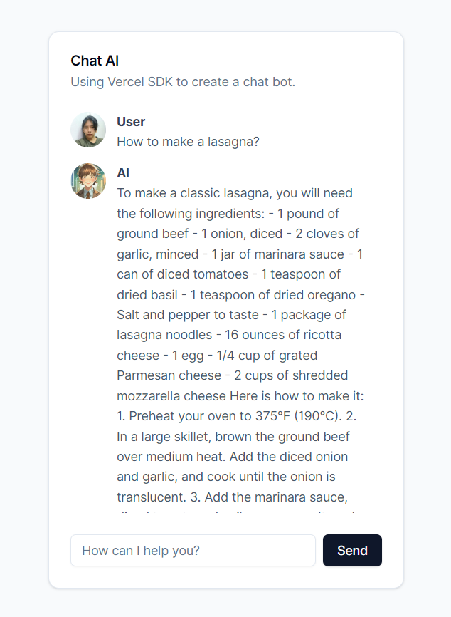

<h1>Chat AI</h1><h2>Description</h2>
This project is a Chat AI application developed using Next.js framework. It utilizes various libraries and tools for UI components, state management, and AI integration.

	

<h2>Installation</h2>
Before you start, make sure you have Node.js and npm installed on your machine.
<ol><li>Clone the repository:<pre>

<code class="!whitespace-pre hljs language-bash">git clone https://github.com/your-username/chat-ai.git
</code>

</pre></li><li>Navigate to the project directory:<pre>

<code class="!whitespace-pre hljs language-bash">cd chat-ai
</code>

</pre></li><li>Install dependencies:<pre>

<code class="!whitespace-pre hljs language-bash">npm install
</code>

</pre></li></ol><h2>Usage</h2>
To run the development server:
<pre>

<code class="!whitespace-pre hljs language-bash">npm run dev
</code>

</pre>
To build the project:
<pre>

<code class="!whitespace-pre hljs language-bash">npm run build
</code>

</pre>
To start the production server:
<pre>

<code class="!whitespace-pre hljs language-bash">npm start
</code>

</pre><h2>Dependencies</h2><ul><li>@radix-ui/react-avatar: ^1.0.4</li><li>@radix-ui/react-icons: ^1.3.0</li><li>@radix-ui/react-scroll-area: ^1.0.5</li><li>@radix-ui/react-slot: ^1.0.2</li><li>ai: ^2.2.36</li><li>class-variance-authority: ^0.7.0</li><li>clsx: ^2.1.0</li><li>next: 14.1.0</li><li>openai: ^4.28.0</li><li>react: ^18</li><li>react-dom: ^18</li><li>tailwind-merge: ^2.2.1</li><li>tailwindcss-animate: ^1.0.7</li></ul><h2>Development Dependencies</h2><ul><li>@types/node: ^20</li><li>@types/react: ^18</li><li>@types/react-dom: ^18</li><li>autoprefixer: ^10.0.1</li><li>eslint: ^8</li><li>eslint-config-next: 14.1.0</li><li>postcss: ^8</li><li>prettier: ^3.2.5</li><li>prettier-plugin-tailwindcss: ^0.5.11</li><li>tailwindcss: ^3.3.0</li><li>typescript: ^5</li></ul>
